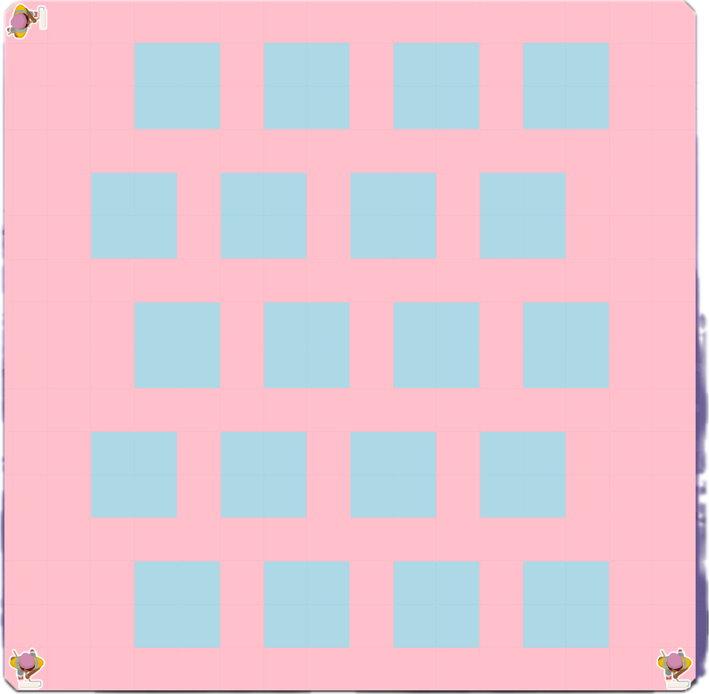

# Unit 1 - Asphalt Art

## Introduction

Cities use asphalt art to improve public safety, inspire their residents and visitors, and brighten communities. Your goal is to create asphalt art to revitalize The Neighborhood and bring the community together with the help of the Painter.

## Requirements

Use your knowledge of object-oriented programming, algorithms, the problem solving process, and decomposition strategies to create asphalt art:
- **Create a new subclass** – Create at least one new subclass of the PainterPlus class that is used for a component of the asphalt art design.
- **Plan an algorithm** – Use the problem solving process and decomposition strategies to plan an algorithm that incorporates a combination of sequencing, selection, and/or iteration.
- **Write a method** – Write at least one method in a PainterPlus subclass that contributes to a component of the asphalt art design.
- **Document your code** – Use comments to explain the purpose of the methods and code segments.

## Notes: Neighborhood & Painter Class

This project was created on Code.org's JavaLab platform using the built in Neightborhood GUI output. To test and edit this project you must build in Code.org's JavaLab with the Neighborhood GUI enabled. For reference to the Painter class documentation, [you can read more here.](https://studio.code.org/docs/ide/javalab/classes/Painter)

## Output:

### Sketch:

### Final Image:
  

## Reflection

1. Describe your project.

   -My project is a 5 story, pink apartment with blue windows. 

2. What are two things about your project that you are proud of?

   -One thing that I am most proud of my project is that the apartment is pink, which is my favorite color. 
   
   -Another thing that I am most proud of my project is that when the code is running, the Painter paints the edges of the grid first, so it's really cool to see that.

3. Describe something you would improve or do differently if you had an opportunity to change something about your project.

   -Something that I would do to improve my project if I had an oppurtunity would be to add details to the walls of the apartment. For example, I could add a cute little flower on the side of the wall. 